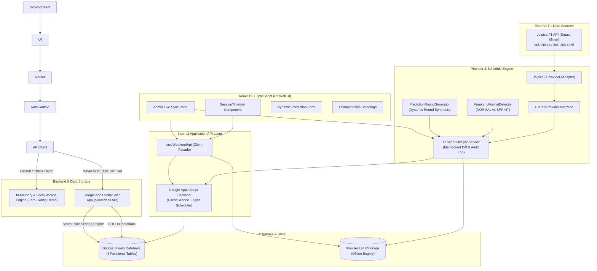

# 🏎️ F1 Community Prediction League

[](https://react.dev/)
[](https://www.typescriptlang.org/)
[](https://vitejs.dev/)
[](https://developers.google.com/apps-script)
[](LICENSE)

An interactive, motorsport-inspired Formula 1 prediction web application designed for racing communities. Users predict outcomes across all sessions of a Formula 1 weekend (Practice, Sprint Qualifying, Sprint Race, Qualifying, and Grand Prix) and compete on dynamic session, weekend, and season championship leaderboards.

> 📖 **Full System Architecture Documentation**: See [docs/ARCHITECTURE.md](./docs/ARCHITECTURE.md) for complete **C1, C2, C3, and C4 diagrams**, relational database schemas, end-to-end sequence workflows, and operational guides.

---

## 🌟 Key Features

- **External F1 Data Integration (Jolpica F1 API)**:
  - Plug-and-play **`F1DataProvider`** abstraction layer decoupled from specific vendors.
  - Primary integration with **Jolpica F1 Ergast API** (`https://api.jolpi.ca/ergast/f1/`) with automated fallback mirror.
  - Automatic season calendar synchronization, session scheduling, and circuit metadata ingestion.
- **Dynamic Weekend Detection & Prediction Round Generator**:
  - Automatically identifies **NORMAL** vs. **SPRINT** formats by inspecting session types (`SPRINT` / `SPRINT_QUALIFYING`) without fragile hardcoded lists.
  - Dynamically synthesizes prediction rounds: **2 rounds** for Conventional Grands Prix (Qualifying + Race) and **4 rounds** for Sprint Weekends (Sprint Qualifying, Sprint Race, Qualifying, and Race).
  - Configurable prediction window offsets (closes 5 minutes prior to session lights-out; GP opens post-Qualifying).
- **Idempotent Synchronization & Change Detection**:
  - Diffing engine detects schedule time adjustments, session delays, or newly added rounds without duplicating database rows.
  - Automatically shifts prediction window deadlines while strictly preserving existing user predictions.
  - Audit logging to `SyncLogs` table tracking `CREATED`, `UPDATED`, `NO_CHANGE`, and `ERROR` events.
- **Interactive Chronological Session Timeline**:
  - `SessionTimeline` interleaving practice sessions, qualifying, sprint, and race sessions with respective prediction rounds, live countdown timers, and contextual action buttons.
- **Admin Live Calendar Control Panel**:
  - Interactive season selector, live sync trigger, database health metrics, and audit log history.
- **Generic Prediction Round System**: Designed around dynamic prediction rounds rather than hardcoded weekend templates. Seamlessly handles **Conventional Grand Prix** weekends, **Sprint** weekends, and future session formats purely via configuration.
- **Dynamic Form Generation**: Prediction fields (Podium, Fastest Lap, Driver of the Day, Wildcards) are driven by backend JSON schema.
- **Mutual Exclusion & Duplicate Prevention**: Selecting a driver for P1 automatically disables them for P2 and P3 slots, preventing invalid podium combinations.
- **Modular Scoring Engine**:
  - Exact P1: **15 pts**
  - Exact P2 / P3: **10 pts**
  - Podium in incorrect position: **5 pts**
  - Fastest Lap: **10 pts**
  - Driver of the Day: **10 pts**
  - Session Wildcard: **15 pts**
  - 🎯 **Perfect 1-2-3 Podium Bonus**: **+10 pts**
- **Three-Tier Leaderboards**:
  1. **Session Leaderboard**: Individual round point breakdowns.
  2. **Weekend Championship**: Combined points from all sessions of a single Grand Prix.
  3. **Season Championship**: Real-time standings with rank change indicators (+2, -1, =), average points, exact P1 counts, and leader crowns.
- **Driver Profile & Trophies**:
  - Telemetry statistics: Accuracy, Exact P1s, Perfect Podiums, Wildcards correct.
  - Configurable achievement badges: *Bullseye*, *Strategy Master*, *On Fire*, *Consistency King*, and *Ferrari Strategist*.
- **Telemetry Pit Wall UI**: Dark racing carbon UI (`#080a0f`), high-contrast telemetry accents, sector timing monospace typography (`JetBrains Mono`), animated deadline countdowns, and celebratory confetti effects.
- **Dual-Backend Ready**:
  - **Live Google Apps Script API**: Lightweight serverless API powered by Google Sheets (`backend/Code.gs` + `backend/SetupSheet.gs`).
  - **Instant Offline Mock Engine**: Automatic fallback with pre-seeded 2026 driver/team data and `localStorage` persistence for instant portfolio evaluation.

---

## 📐 Architecture



---

## 🛠️ Technology Stack

- **Frontend**: React 19, TypeScript, React Router v7, Vite
- **Styling**: Vanilla CSS with custom motorsport design tokens, Google Fonts (`Outfit`, `JetBrains Mono`)
- **Icons & Effects**: `lucide-react`, `canvas-confetti`
- **Backend**: Google Apps Script (Serverless JavaScript executing inside Google Cloud)
- **Database**: Google Sheets (Relational tables: `Users`, `RaceWeekends`, `Sessions`, `PredictionRounds`, `Predictions`, `Results`, `Scores`, `Achievements`)
- **Hosting**: GitHub Pages with CI/CD (automated via GitHub Actions workflow on `main` push)
- **Live URL**: [https://hj1418.github.io/F1-Prediction-Wall/](https://hj1418.github.io/F1-Prediction-Wall/)

---

## 📸 Screenshots & UI Tour

| Homepage & Hero Countdown | Dynamic Prediction Experience |
| :---: | :---: |
|  |  |
| *Motorsport hero card, live countdown, and weekend timeline* | *Driver picker with mutual exclusion and deadline locks* |

| Season Leaderboard & Telemetry | Live Submission & Feedback |
| :---: | :---: |
|  |  |
| *Rank change deltas, race totals, and podium badges* | *Instant confirmation, status chips, and score breakdowns* |

---

## 📊 Google Sheets Database Design

The backend uses 9 relational tables:

1. **`Users`**: `userId`, `email`, `displayName`, `username`, `favouriteDriver`, `favouriteConstructor`, `role`, `createdAt`, `totalPoints`, `seasonRank`
2. **`RaceWeekends`**: `raceWeekendId`, `season`, `raceName`, `country`, `circuit`, `weekendType`, `startDate`, `endDate`, `status`, `circuitLengthKm`, `laps`
3. **`Sessions`**: `sessionId`, `raceWeekendId`, `sessionType`, `name`, `startTime`, `endTime`, `status`
4. **`PredictionRounds`**: `roundId`, `raceWeekendId`, `sessionId`, `roundType`, `title`, `description`, `opensAt`, `closesAt`, `status`, `predictionFields`, `scoringRules`
5. **`Predictions`**: `predictionId`, `userId`, `roundId`, `predictionData`, `submittedAt`, `updatedAt`, `lockedAt`
6. **`Results`**: `resultId`, `roundId`, `resultData`, `publishedAt`
7. **`Scores`**: `scoreId`, `userId`, `roundId`, `scoreBreakdown`, `totalScore`, `calculatedAt`
8. **`Achievements`**: `achievementId`, `userId`, `achievementType`, `title`, `description`, `badgeIcon`, `earnedAt`
9. **`SyncLogs`**: `logId`, `season`, `raceWeekendId`, `action`, `details`, `timestamp`

---

## ⚡ Quick Start (Local Development)

### 1. Clone & Install Dependencies
```bash
git clone https://github.com/Hj1418/F1-Prediction-Wall.git
cd F1-Prediction-Wall
npm install
```

### 2. Run Automated Scoring & Sync Unit Tests
```bash
npm test
```
*Executes all 61 test suites validating exact P1/P2/P3 points, wrong position podium calculations, wildcard scoring, idempotency, Jolpica format detection, dynamic round synthesis, prediction window status engines, schedule drift change detection, circuit SVG asset verification, and audit logging.*

### 3. Start Development Server
```bash
npm run dev
```
Open [http://localhost:5173](http://localhost:5173) in your browser.

---

## ☁️ Google Apps Script Backend Deployment

1. Create a new Google Spreadsheet at [sheets.new](https://sheets.new).
2. Open **Extensions > Apps Script**.
3. Copy [`backend/Code.gs`](./backend/Code.gs) into the script editor.
4. Add [`backend/SetupSheet.gs`](./backend/SetupSheet.gs) and run `initializeDatabase()`. This will automatically create and format all 8 tables.
5. Click **Deploy > New deployment > Web app**:
   - **Execute as**: `Me`
   - **Who has access**: `Anyone`
6. Copy the **Web App URL** and add it to `.env`:
   ```env
   VITE_API_URL=https://script.google.com/macros/s/AKfycbx.../exec
   ```
*(If no `.env` is provided, the application runs automatically using the built-in mock engine).*

---

## 🚢 Deploying to GitHub Pages

The project uses an automated **GitHub Actions CI/CD pipeline** (`.github/workflows/deploy.yml`) that deploys on every push to `main`:

1. **Automated Deployment**: Every push to `main` triggers:
   - Dependency installation (`npm ci`)
   - Full test suite execution (`npm test`)
   - Production build (`npm run build`)
   - Deployment to GitHub Pages via `actions/deploy-pages@v4`

2. **Manual Deployment** (alternative):
   ```bash
   npm run build
   npx gh-pages -d dist
   ```

The project is pre-configured with relative base paths (`./`) in `vite.config.ts`, `HashRouter` navigation, and a `public/404.html` SPA redirect handler.

**Live Site**: [https://hj1418.github.io/F1-Prediction-Wall/](https://hj1418.github.io/F1-Prediction-Wall/)

---

## 📜 License
MIT © 2026 Harsh Vardhan
