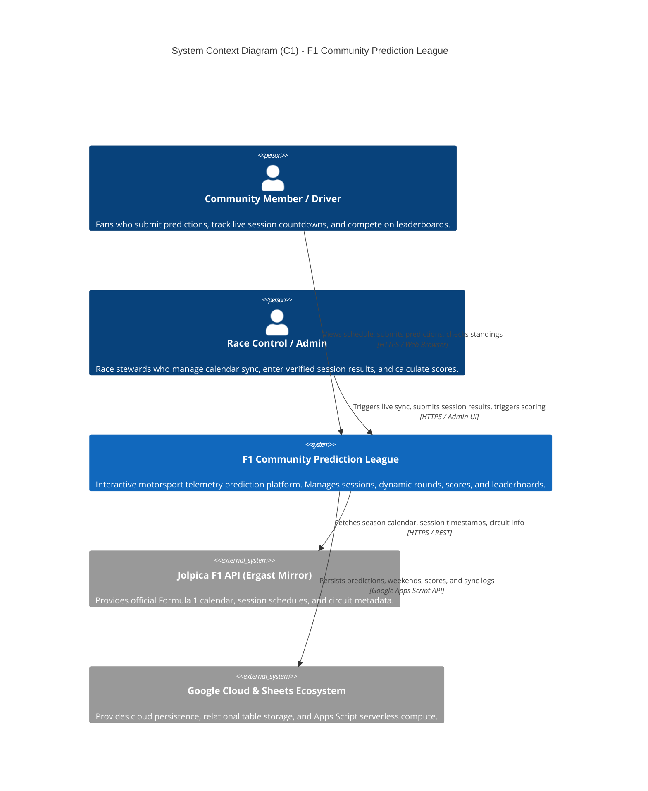
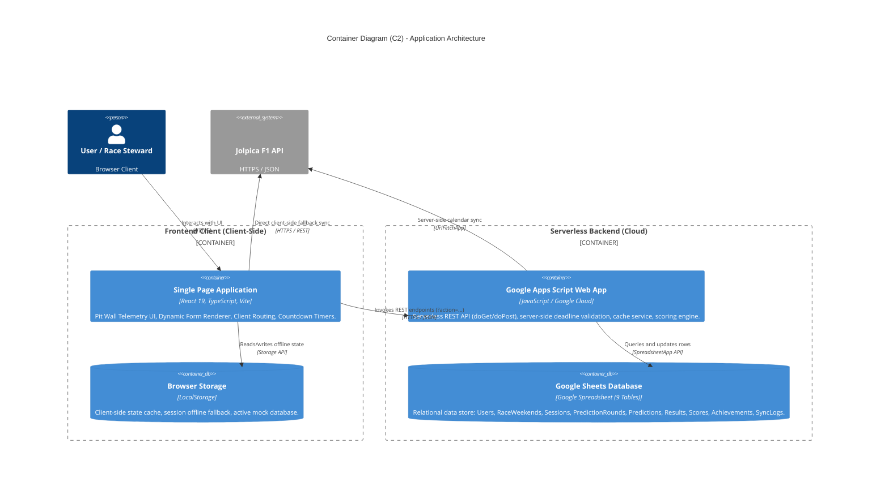
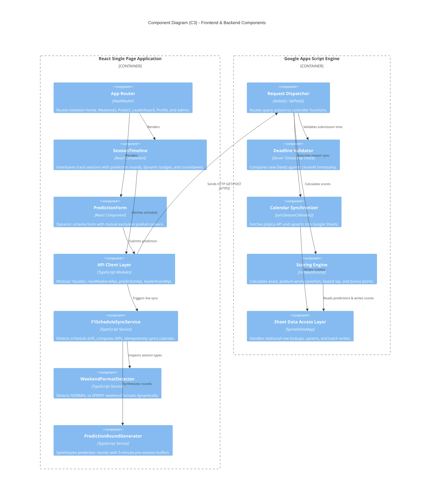
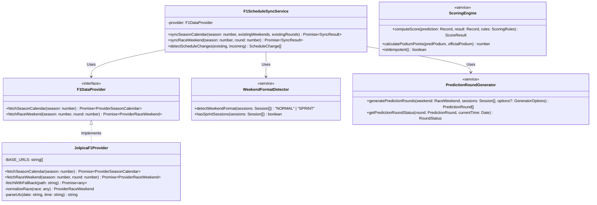
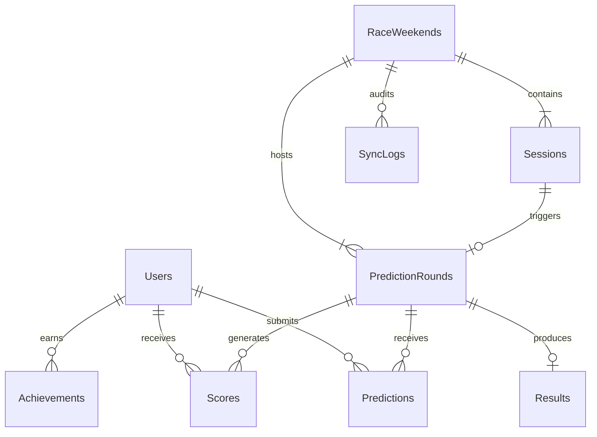
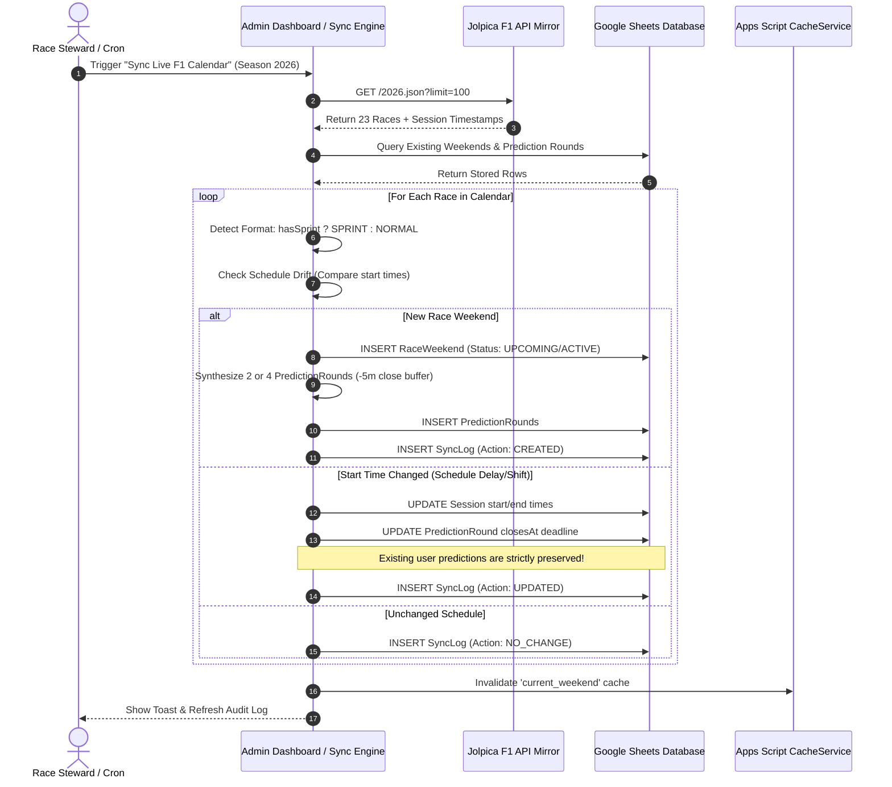
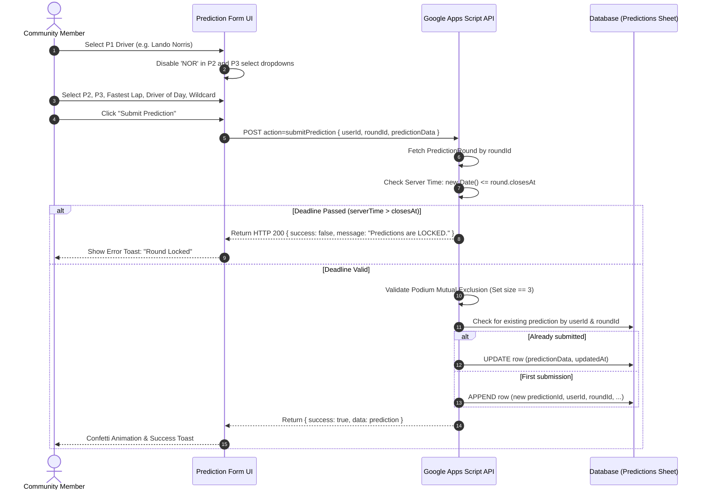
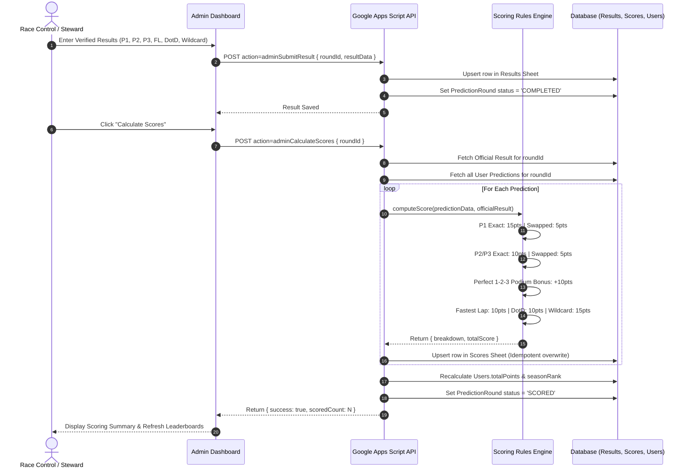
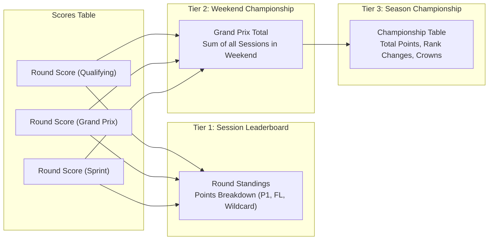

# 🏎️ F1 Community Prediction League - Technical Architecture & System Design Documentation

---

## 📑 Table of Contents
1. [Executive Summary & System Overview](#1-executive-summary--system-overview)
2. [C4 Architectural Model](#2-c4-architectural-model)
   - [Level 1: System Context Diagram (C1)](#level-1-system-context-diagram-c1)
   - [Level 2: Container Diagram (C2)](#level-2-container-diagram-c2)
   - [Level 3: Component Diagram (C3)](#level-3-component-diagram-c3)
   - [Level 4: Code-Level Class & Interface Diagram (C4)](#level-4-code-level-class--interface-diagram-c4)
3. [Database Schema & Relational Data Model](#3-database-schema--relational-data-model)
4. [End-to-End System Workflows & Sequence Diagrams](#4-end-to-end-system-workflows--sequence-diagrams)
   - [Workflow 1: External Schedule Sync & Drift Detection](#workflow-1-external-schedule-sync--drift-detection)
   - [Workflow 2: Prediction Submission & Deadline Enforcement](#workflow-2-prediction-submission--deadline-enforcement)
   - [Workflow 3: Official Results Ingestion & Idempotent Scoring](#workflow-3-official-results-ingestion--idempotent-scoring)
   - [Workflow 4: Championship Leaderboard Aggregation](#workflow-4-championship-leaderboard-aggregation)
5. [Technology Stack & Design System](#5-technology-stack--design-system)
6. [Operational Guide & Deployment](#6-operational-guide--deployment)

---

## 1. Executive Summary & System Overview

### 1.1 Background & Problem Statement
Formula 1 race weekends are dynamic, multi-session sporting events consisting of Free Practice sessions, Qualifying, Sprints, and the Grand Prix. Traditional fantasy platforms suffer from significant architectural limitations:
* **Rigid templates**: Hardcoded logic for standard weekends that breaks when Sprint formats or schedule changes occur.
* **Single-deadline locking**: Locking all predictions on Friday morning, diminishing user engagement over the weekend.
* **Lack of transparency**: Opaque scoring formulas with delayed feedback.
* **Complex infrastructure requirements**: Heavy containerized databases that require recurring server hosting costs for small-to-medium communities.

### 1.2 Solution Philosophy
The **F1 Community Prediction League** is built around:
1. **Generic Prediction Rounds**: Treating every competitive track session as an independent, configurable prediction round rather than assuming a fixed weekend structure.
2. **Dual-Backend Strategy**: Instant zero-config evaluation in local/offline demo mode via `localStorage`, paired with a serverless Google Apps Script + Google Sheets database backend for zero-cost production hosting.
3. **Automated Live Calendar Synchronization**: Decoupled data provider integration (Jolpica F1 Ergast API mirror) with automatic weekend format detection (`NORMAL` vs `SPRINT`), dynamic prediction round generation, and schedule drift change detection.
4. **Motorsport Pit Wall UI**: High-contrast dark telemetry aesthetic (`#080a0f`), monospace sector timing typography, countdown clocks, and instant visual feedback.

---

## 2. C4 Architectural Model

### Level 1: System Context Diagram (C1)
The Context diagram illustrates the high-level boundary of the F1 Prediction League system and its interactions with human users and external services.



---

### Level 2: Container Diagram (C2)
The Container diagram highlights the high-level technical building blocks that execute the system.



---

### Level 3: Component Diagram (C3)
The Component diagram drills into the Single Page Application and the Google Apps Script Backend.



---

### Level 4: Code-Level Class & Interface Diagram (C4)
The Code-level diagram details the object model, interface contracts, and adapter relationships.



---

## 3. Database Schema & Relational Data Model

The application database is designed as a relational system with 9 tables hosted in Google Sheets (or indexed in client-side LocalStorage):



### Table Definitions

#### 1. `Users`
Stores player and steward credentials, community telemetry, and season totals.
| Column | Type | Description |
| :--- | :--- | :--- |
| `userId` (PK) | `string` | Unique identifier (e.g., `user_harsh`) |
| `email` | `string` | User email address |
| `displayName` | `string` | Community screen name |
| `username` | `string` | URL-safe handle |
| `avatarUrl` | `string` | URL to profile picture |
| `favouriteDriver` | `string` | Driver ID (e.g., `leclerc`) |
| `role` | `enum` | `'user'` \| `'admin'` |
| `createdAt` | `ISO8601` | Timestamp of account registration |
| `totalPoints` | `number` | Aggregated championship points |
| `seasonRank` | `number` | Current championship standing rank |

#### 2. `RaceWeekends`
Stores Grand Prix events and weekend-level metadata.
| Column | Type | Description |
| :--- | :--- | :--- |
| `raceWeekendId` (PK) | `string` | Formatted ID (e.g., `2026_13`) |
| `season` | `number` | Season year (e.g., `2026`) |
| `round` | `number` | Official championship round number (e.g., `13`) |
| `name` | `string` | Grand Prix name (e.g., `Italian Grand Prix`) |
| `country` | `string` | Host nation |
| `circuitId` | `string` | Unique circuit slug (e.g., `monza`) |
| `circuitName` | `string` | Official circuit venue |
| `weekendType` | `enum` | `'NORMAL'` \| `'SPRINT'` |
| `startDate` | `ISO8601` | Friday FP1 start time |
| `endDate` | `ISO8601` | Sunday Grand Prix end time |
| `status` | `enum` | `'UPCOMING'` \| `'ACTIVE'` \| `'COMPLETED'` |
| `externalProvider` | `string` | Data source (`JOLPICA_F1`) |
| `externalId` | `string` | Remote identifier |
| `lastSyncedAt` | `ISO8601` | Timestamp of most recent sync |

#### 3. `Sessions`
Stores competitive and practice track sessions.
| Column | Type | Description |
| :--- | :--- | :--- |
| `sessionId` (PK) | `string` | Formatted ID (e.g., `2026_13_QUALIFYING`) |
| `raceWeekendId` (FK) | `string` | References `RaceWeekends.raceWeekendId` |
| `sessionType` | `enum` | `'FP1'` \| `'FP2'` \| `'FP3'` \| `'SPRINT_QUALIFYING'` \| `'SPRINT'` \| `'QUALIFYING'` \| `'RACE'` |
| `sessionName` | `string` | Display title (e.g., `Practice 1`, `Grand Prix Qualifying`) |
| `startTime` | `ISO8601` | Green flag lights-out timestamp |
| `endTime` | `ISO8601` | Projected chequered flag timestamp |
| `status` | `enum` | `'UPCOMING'` \| `'ACTIVE'` \| `'COMPLETED'` |
| `externalProvider` | `string` | `JOLPICA_F1` |
| `externalId` | `string` | Remote session identifier |
| `lastSyncedAt` | `ISO8601` | Last sync timestamp |

#### 4. `PredictionRounds`
Stores individual prediction rounds with dynamic fields and deadline rules.
| Column | Type | Description |
| :--- | :--- | :--- |
| `roundId` (PK) | `string` | E.g., `2026_13_QUALIFYING_PREDICTION` |
| `raceWeekendId` (FK) | `string` | References `RaceWeekends.raceWeekendId` |
| `sessionId` (FK) | `string` | Associated track session |
| `roundType` | `enum` | `'QUALIFYING'` \| `'SPRINT_QUALIFYING'` \| `'SPRINT'` \| `'RACE'` |
| `title` | `string` | Round display title |
| `description` | `string` | Description and guidance for players |
| `opensAt` | `ISO8601` | Round open timestamp |
| `closesAt` | `ISO8601` | Strict prediction lock deadline (5m before session) |
| `status` | `enum` | `'UPCOMING'` \| `'OPEN'` \| `'LOCKED'` \| `'COMPLETED'` \| `'SCORED'` |
| `predictionFields` | `JSON` | Array of field configs (`p1`, `p2`, `p3`, `fastestLap`, etc.) |
| `scoringRules` | `JSON` | Configurable point values for this round |
| `lastSyncedAt` | `ISO8601` | Last update timestamp |

#### 5. `Predictions`
Stores player prediction submissions with mutual exclusion data.
| Column | Type | Description |
| :--- | :--- | :--- |
| `predictionId` (PK) | `string` | UUID (e.g., `pred_9f8b2...`) |
| `userId` (FK) | `string` | References `Users.userId` |
| `roundId` (FK) | `string` | References `PredictionRounds.roundId` |
| `predictionData` | `JSON` | `{ p1: "NOR", p2: "VER", p3: "PIA", fastestLap: "NOR", ... }` |
| `submittedAt` | `ISO8601` | Initial submission timestamp |
| `updatedAt` | `ISO8601` | Last update timestamp |
| `lockedAt` | `ISO8601` | Timestamp when round locked |

#### 6. `Results`
Stores official session outcomes entered by Race Stewards.
| Column | Type | Description |
| :--- | :--- | :--- |
| `resultId` (PK) | `string` | UUID (e.g., `res_7a1c...`) |
| `roundId` (FK) | `string` | References `PredictionRounds.roundId` |
| `resultData` | `JSON` | Official verified outcome data |
| `publishedAt` | `ISO8601` | Publication timestamp |

#### 7. `Scores`
Stores calculated scores and category breakdowns.
| Column | Type | Description |
| :--- | :--- | :--- |
| `scoreId` (PK) | `string` | UUID |
| `userId` (FK) | `string` | References `Users.userId` |
| `roundId` (FK) | `string` | References `PredictionRounds.roundId` |
| `scoreBreakdown` | `JSON` | Detailed breakdown by category |
| `totalScore` | `number` | Sum of all points earned |
| `calculatedAt` | `ISO8601` | Calculation timestamp |

#### 8. `Achievements`
Stores earned player trophies and badges.
| Column | Type | Description |
| :--- | :--- | :--- |
| `achievementId` (PK) | `string` | UUID |
| `userId` (FK) | `string` | References `Users.userId` |
| `achievementType` | `enum` | `BULLSEYE`, `STRATEGY_MASTER`, `ON_FIRE`, `CONSISTENCY_KING`, etc. |
| `title` | `string` | Badge name |
| `description` | `string` | Criteria description |
| `badgeIcon` | `string` | Icon name or emoji |
| `earnedAt` | `ISO8601` | Award timestamp |

#### 9. `SyncLogs`
Stores synchronization audit history and schedule change detection logs.
| Column | Type | Description |
| :--- | :--- | :--- |
| `logId` (PK) | `string` | UUID |
| `season` | `number` | Formula 1 season year |
| `raceWeekendId` | `string` | Grand Prix ID |
| `action` | `enum` | `'CREATED'` \| `'UPDATED'` \| `'NO_CHANGE'` \| `'ERROR'` |
| `details` | `string` | Description of changes detected or result |
| `timestamp` | `ISO8601` | Execution timestamp |

---

## 4. End-to-End System Workflows & Sequence Diagrams

### Workflow 1: External Schedule Sync & Drift Detection
Demonstrates how the system checks the live Jolpica API, detects schedule modifications or time delays, updates prediction deadlines, and preserves user predictions.



---

### Workflow 2: Prediction Submission & Deadline Enforcement
Demonstrates client-side validation, mutual exclusion on podium drivers, and server-side deadline verification.



---

### Workflow 3: Official Results Ingestion & Idempotent Scoring
Demonstrates how verified session outcomes are submitted and calculated without duplicate point accumulation.



---

### Workflow 4: Championship Leaderboard Aggregation
The leaderboard system aggregates scores dynamically at three granular levels:



1. **Session Leaderboard**: Individual round point breakdowns for immediate session review.
2. **Weekend Championship**: Combined points from all sessions of a single Grand Prix event.
3. **Season Championship**: Comprehensive championship table with rank change indicators (`+2`, `-1`, `=`), exact P1 counts, perfect podium counts, and leader crowns.

---

## 5. Technology Stack & Design System

### 5.1 Technology Overview
| Layer | Technologies | Purpose |
| :--- | :--- | :--- |
| **Frontend Framework** | React 19, TypeScript 5.x, Vite 8.x | Modern UI architecture, typed components, rapid HMR |
| **Client Routing** | React Router v7 (`HashRouter`) | Deep-linking compatible with GitHub Pages hosting |
| **Design & Styling** | Vanilla CSS, Design Tokens | High-performance custom motorsport pit wall theme |
| **Typography** | Google Fonts (`Outfit`, `JetBrains Mono`) | Monospace sector timing + modern geometric sans-serif |
| **Icons & Effects** | `lucide-react`, `canvas-confetti` | Telemetry UI iconography and celebratory interactions |
| **Serverless API** | Google Apps Script | Zero-cost serverless execution running on Google Cloud |
| **Cloud Database** | Google Sheets (9 Relational Sheets) | Human-inspectable, tabular cloud database with versioning |
| **F1 Data Integration** | Jolpica F1 Ergast API Mirror | Real-time season calendar, session timing, circuit metadata |
| **Automated Testing** | Node.js Test Suite (37 Tests) | Unit & integration tests for scoring, sync, and format detection |

### 5.2 Scoring Rules Specification
The scoring engine implements strict motorsport scoring rules:
* **Exact P1**: `15 points`
* **Exact P2 / P3**: `10 points each`
* **Podium Driver in Wrong Position**: `5 points` (awarded if a driver finishes on the podium but not in the predicted position)
* **🎯 Perfect 1-2-3 Podium Bonus**: `+10 points` (awarded only if P1, P2, and P3 are all exactly correct)
* **Fastest Lap**: `10 points`
* **Driver of the Day**: `10 points`
* **Session Wildcard**: `15 points`
* **Maximum Possible Single Session Score**: `80 points`

---

## 6. Operational Guide & Deployment

### 6.1 Local Development
```bash
# 1. Clone repository
git clone https://github.com/Hj1418/F1-Prediction-Wall.git
cd F1-Prediction-Wall

# 2. Install dependencies
npm install

# 3. Run automated tests (Scoring + Sync)
npm test

# 4. Start local development server
npm run dev
```

### 6.2 Google Sheets Backend Deployment
1. Create a blank spreadsheet at [sheets.new](https://sheets.new).
2. Open **Extensions > Apps Script**.
3. Copy [`backend/Code.gs`](../backend/Code.gs) and [`backend/SetupSheet.gs`](../backend/SetupSheet.gs).
4. Run `initializeDatabase()` in `SetupSheet.gs` to create all 9 tables.
5. Click **Deploy > New deployment > Web app**:
   - **Execute as**: `Me`
   - **Who has access**: `Anyone`
6. Copy the Web App URL and add it to `.env`:
   ```env
   VITE_API_URL=https://script.google.com/macros/s/your-id/exec
   ```

### 6.3 GitHub Pages Deployment
The repository includes automated single-page application routing via `HashRouter` and `public/404.html`:
```bash
npm run build
npx gh-pages -d dist
```

---
*Authored for the F1 Community Prediction League project. MIT License.*
